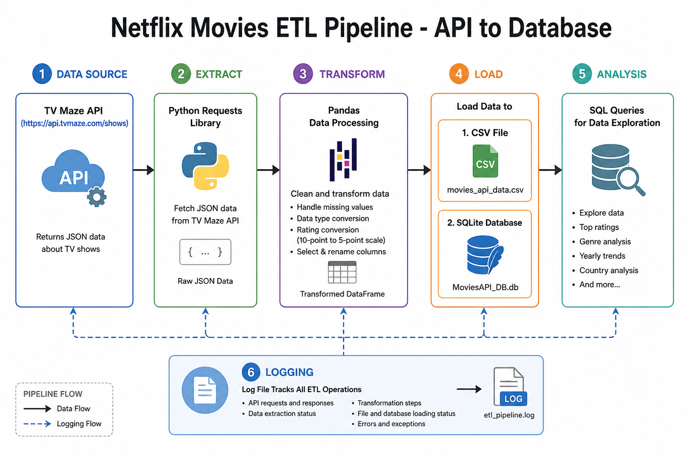

# Netflix Movies and TV Shows Data Analysis

## Overview

This project demonstrates a complete ETL (Extract, Transform, Load) pipeline for analyzing TV show data from an external API. The pipeline extracts data from the TVMaze API, transforms ratings to a standardized scale, and loads the results into both CSV and SQLite database formats.

## Project Objective

Build an automated data pipeline that:
- Extracts TV show information from a REST API
- Transforms rating data from 10-point to 5-point scale
- Loads processed data into multiple storage formats
- Maintains detailed execution logs

## Architecture



```
┌─────────────┐
│  TVMaze API │
└──────┬──────┘
       │ Extract
       ▼
┌─────────────┐
│   Transform │ (Rating conversion)
└──────┬──────┘
       │ Load
       ▼
┌─────────────────────────┐
│  CSV File  │  SQLite DB │
└─────────────────────────┘
```

## Technology Stack

- **Python 3.x**: Core programming language
- **Pandas**: Data manipulation and transformation
- **Requests**: HTTP library for API calls
- **SQLite3**: Lightweight database for data storage
- **Jupyter Notebook**: Interactive development environment

## Project Structure

```
CaseStudyInvestigatingNetflixMoviesandGuestStarsinTheOffice/
├── README.md
├── movie_project.ipynb      # Main ETL pipeline notebook
├── movies_api_data.csv      # Output CSV file
├── netflix.png              # Project visualization
└── logs/
    └── movies_logs          # Execution logs
```

## Features

### 1. Data Extraction
- Connects to TVMaze API
- Retrieves comprehensive TV show data
- Handles API responses in JSON format

### 2. Data Transformation
- Converts ratings from 10-point to 5-point scale
- Cleans and standardizes data fields
- Applies rounding for consistent formatting

### 3. Data Loading
- Exports to CSV for easy sharing and analysis
- Stores in SQLite database for querying
- Maintains data integrity across formats

### 4. Logging System
- Tracks each pipeline stage
- Records timestamps for all operations
- Facilitates debugging and monitoring

## Installation & Setup

### Prerequisites
```bash
Python 3.7+
Jupyter Notebook
```

### Install Dependencies
```bash
pip install pandas requests jupyter
```

## Usage

### Running the Pipeline

1. Open Jupyter Notebook:
```bash
jupyter notebook movie_project.ipynb
```

2. Execute cells sequentially to:
   - Extract data from API
   - Transform ratings
   - Load to CSV and database
   - Run SQL queries

### Sample Queries

The notebook includes example queries:
```sql
-- Get all shows
SELECT * FROM MoviesAPI;

-- Get highly rated shows (4.5+ stars)
SELECT title, Rating_5 
FROM MoviesAPI 
WHERE Rating_5 >= 4.5;
```

## Pipeline Functions

### `extract(api_url)`
Fetches data from the specified API endpoint and returns a pandas DataFrame.

### `transform(df)`
Converts rating column from 10-point to 5-point scale with one decimal precision.

### `load_to_csv(df, output_path)`
Exports DataFrame to CSV file at the specified path.

### `load_to_db(df, sql_conn, table_name)`
Loads DataFrame into SQLite database table.

### `run_query(query_statement, sql_conn)`
Executes SQL query and displays results.

### `log_progress(message)`
Appends timestamped log entries to the log file.

## Data Schema

### Output Table Structure
| Column | Type | Description |
|--------|------|-------------|
| id | Integer | Unique show identifier |
| name | String | Show title |
| type | String | Content type (Scripted, Reality, etc.) |
| language | String | Primary language |
| genres | Array | Show genres |
| rating | Float | Original 10-point rating |
| Rating_5 | Float | Converted 5-point rating |

## Key Learnings

- API integration and data extraction
- Data transformation techniques
- Multi-format data loading
- ETL pipeline design patterns
- Logging and monitoring best practices

## Future Enhancements

- Add error handling for API failures
- Implement incremental data loading
- Add data quality validation checks
- Create automated scheduling
- Build visualization dashboard

## Notes

- The API endpoint can be changed to analyze different data sources
- Rating conversion formula: `Rating_5 = round(rating / 2, 1)`
- Logs are appended to maintain historical execution records
- Database table is replaced on each run (use `if_exists='append'` for incremental loads)

## Troubleshooting

| Issue | Solution |
|-------|----------|
| API connection timeout | Check internet connection and API availability |
| Import errors | Ensure all dependencies are installed |
| Database locked | Close any open connections to the SQLite file |
| Empty CSV output | Verify API returned data successfully |

## References

- [TVMaze API Documentation](https://www.tvmaze.com/api)
- [Pandas Documentation](https://pandas.pydata.org/docs/)
- [SQLite Python Tutorial](https://docs.python.org/3/library/sqlite3.html)
