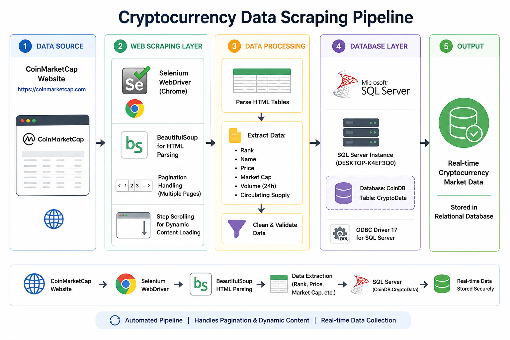

# CoinMarketCap Data Scraping

## Overview

Automated web scraping project to extract real-time cryptocurrency market data from CoinMarketCap. This project demonstrates web scraping techniques, data extraction, and automated data collection for cryptocurrency market analysis.

## Architecture



## Project Objective

Build an automated scraper that:
- Extracts cryptocurrency prices and market data
- Collects historical price trends
- Stores data for analysis
- Enables market tracking and monitoring

## Technology Stack

- **Python 3.x**: Core programming language
- **BeautifulSoup4**: HTML parsing
- **Requests**: HTTP requests
- **Pandas**: Data manipulation
- **Jupyter Notebook**: Development environment

## Features

- Real-time cryptocurrency price extraction
- Market cap and volume data collection
- Multiple cryptocurrency tracking
- Data export to CSV format
- Automated data refresh

## Installation

```bash
pip install beautifulsoup4 requests pandas lxml
```

## Usage

```python
# Run the scraping notebook
jupyter notebook scrapping.ipynb
```

## Data Collected

- Cryptocurrency name
- Current price
- Market capitalization
- 24h trading volume
- Price change percentage
- Circulating supply

## Legal & Ethical Considerations

- Respects robots.txt
- Implements rate limiting
- For educational purposes only
- No commercial use

## References

- [CoinMarketCap](https://coinmarketcap.com/)
- [BeautifulSoup Documentation](https://www.crummy.com/software/BeautifulSoup/)
