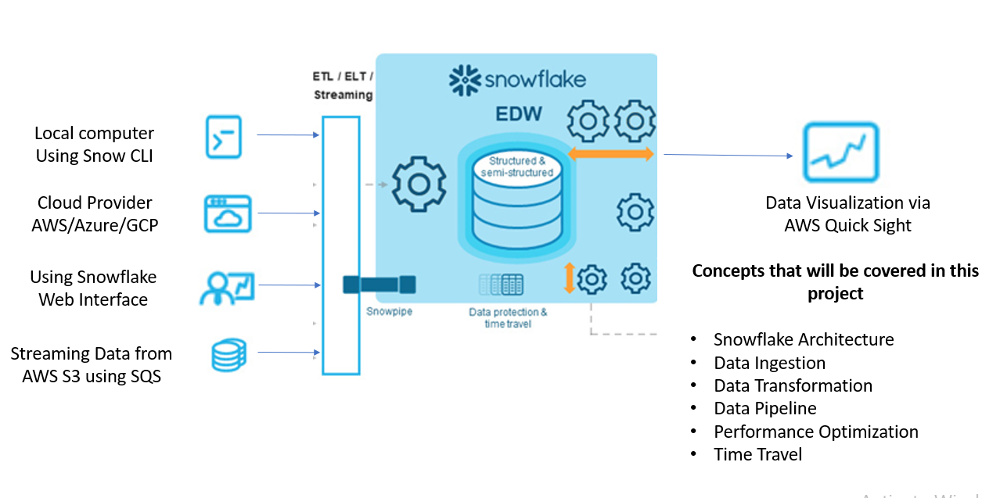

# Snowflake Data Loading Project

Comprehensive guide to loading data into Snowflake using multiple methods including web interface, SnowSQL CLI, cloud storage integration, and Snowpipe streaming.

## Business Overview

Snowflake's Data Cloud is a cutting-edge data platform delivered as a service (SaaS). It provides data storage, processing, and analytic solutions that are quicker, easier to use, and more versatile than traditional options.

Key advantages:
- No hardware to choose, install, configure, or manage
- Minimal software installation and maintenance
- Snowflake handles ongoing maintenance, administration, and updates

## Tech Stack

- **Languages**: SQL
- **Services**: Amazon S3, Snowflake, SnowSQL, QuickSight

## Project Structure

```
snowflake-loading-data/
├── data/
│   ├── customer_detail.csv      # Sample customer data
│   ├── TSLA.csv                 # Tesla stock data
│   └── TSLAmodified.csv
├── img/
│   ├── flow.png                 # Architecture diagram
│   └── image.png
├── snowflake intro.sql          # All SQL commands
├── s3 policy.txt                # S3 IAM policy
├── trust-policy.txt             # IAM trust policy
└── README.md
```

## Key Learning Topics

- Introduction to Snowflake
- Understanding Snowflake Architecture
- Security in Snowflake
- File preparation and configuration
- Loading data through web interface
- Loading data through SnowSQL
- Loading data using Cloud Provider (S3)
- Streaming data using Snowpipe
- Visualization using QuickSight
- Snowflake pricing
- Time Travel feature
- Performance optimization

## Data Loading Methods

### 1. Loading via Web Interface

Simple drag-and-drop interface for small datasets:

```sql
CREATE DATABASE TEST_DB;
USE DATABASE TEST_DB;

CREATE TABLE CUSTOMER_DETAILS (
    first_name STRING,
    last_name STRING,
    address STRING,
    city STRING,
    state STRING
);
```

Then use Snowflake UI to upload CSV files directly.

### 2. Loading via SnowSQL CLI

For programmatic and automated loading:

```sql
-- Create file format
CREATE OR REPLACE FILE FORMAT PIPE_FORMAT_CLI
    type = 'CSV'
    field_delimiter = '|'
    skip_header = 1;

-- Create stage
CREATE OR REPLACE STAGE PIP_CLI_STAGE
    file_format = PIP_FORMAT_CLI;

-- Upload file from local machine
PUT file://C:\path\to\customer_detail.csv @PIP_CLI_STAGE auto_compress=true;

-- Copy data from stage to table
COPY INTO CUSTOMER_DETAILS
    FROM @PIP_CLI_STAGE
    file_format = (format_name = PIP_FORMAT_CLI)
    on_error = 'skip_file';
```

### 3. Loading from Cloud Storage (S3)

#### Method A: Direct Credentials

```sql
CREATE TABLE TESLA_STOCKS(
    date DATE,
    open_value DOUBLE,
    high_vlaue DOUBLE,
    low_value DOUBLE,
    close_vlaue DOUBLE,
    adj_close_value DOUBLE,
    volume BIGINT
);

-- Create external stage with credentials
CREATE OR REPLACE STAGE BULK_COPY_TESLA_STOCKS
    URL = "s3://your-bucket/TSLA.csv"
    CREDENTIALS = (AWS_KEY_ID='****', AWS_SECRET_KEY='****');

-- Copy data
COPY INTO TESLA_STOCKS
    FROM @BULK_COPY_TESLA_STOCKS
    file_format = (TYPE = 'CSV', FIELD_DELIMITER=',', SKIP_HEADER=1)
    on_error = 'skip_file';
```

#### Method B: Storage Integration (Recommended)

More secure approach using IAM roles:

```sql
-- Create storage integration
CREATE OR REPLACE STORAGE INTEGRATION S3_INTEGRATION
    TYPE = EXTERNAL_STAGE
    STORAGE_PROVIDER = 'S3'
    STORAGE_AWS_ROLE_ARN = 'arn:aws:iam::ACCOUNT:role/ROLE_NAME'
    ENABLED = TRUE
    STORAGE_ALLOWED_LOCATIONS = ('s3://your-bucket/prefix/');

-- Get Snowflake IAM user details
DESC INTEGRATION S3_INTEGRATION;

-- Create stage using integration
CREATE OR REPLACE STAGE S3_INTEGRATION_STAGE
    STORAGE_INTEGRATION = S3_INTEGRATION
    URL = 's3://your-bucket/prefix/'
    FILE_FORMAT = (TYPE = 'CSV', FIELD_DELIMITER=',', SKIP_HEADER=1);

-- Copy data
COPY INTO TESLA_STOCKS FROM @S3_INTEGRATION_STAGE;
```

### 4. Streaming with Snowpipe

Automated, continuous data loading:

```sql
-- Create file format
CREATE OR REPLACE FILE FORMAT S3_TESLA_STAGE_FORMAT
    TYPE = 'CSV'
    FIELD_DELIMITER = ','
    SKIP_HEADER = 1;

-- Create stage
CREATE STAGE S3_TESLA_STAGE
    STORAGE_INTEGRATION = S3_TESLA_INTEGRATION
    URL = 's3://your-bucket/input/'
    FILE_FORMAT = S3_TESLA_STAGE_FORMAT;

-- Create pipe with auto-ingest
CREATE OR REPLACE PIPE S3_TESLA_PIPE AUTO_INGEST=TRUE AS
    COPY INTO TESLA_STOCKS FROM @S3_TESLA_STAGE;

-- Get pipe details for S3 event notification
SHOW PIPES;
```

Configure S3 bucket event notification to trigger the pipe when new files arrive.

## AWS Setup

### S3 Bucket Policy

See `s3 policy.txt` for the IAM policy that grants Snowflake access to your S3 bucket.

### IAM Trust Policy

See `trust-policy.txt` for the trust relationship configuration. Update with:
- Your Snowflake IAM user ARN (from `DESC INTEGRATION`)
- Your Snowflake external ID (from `DESC INTEGRATION`)

## Time Travel

Snowflake's Time Travel allows querying historical data:

```sql
-- Drop and restore table
DROP TABLE TESLA_STOCKS;
UNDROP TABLE TESLA_STOCKS;

-- Query data before a specific statement
SELECT * FROM TESLA_STOCKS
BEFORE (statement => 'STATEMENT_ID')
ORDER BY DATE DESC;
```

## Security Notes

⚠️ **Never commit sensitive information**:
- AWS access keys and secret keys
- Snowflake passwords
- IAM role ARNs (use placeholders in documentation)
- `.pem` or `.key` files

All sensitive file patterns are in `.gitignore`.

## Best Practices

1. **Use Storage Integration** instead of hardcoded credentials
2. **Enable AUTO_RESUME** on warehouses for cost optimization
3. **Use appropriate file formats** (Parquet, ORC for large datasets)
4. **Implement error handling** with `ON_ERROR` parameter
5. **Monitor costs** using Snowflake's resource monitors
6. **Use Snowpipe** for continuous, automated loading
7. **Leverage Time Travel** for data recovery and auditing

## Visualization

Connect QuickSight or other BI tools to Snowflake for data visualization and dashboards.

## Architecture



## Resources

- [Snowflake Documentation](https://docs.snowflake.com/)
- [S3 Integration Guide](https://docs.snowflake.com/en/user-guide/data-load-s3-config-storage-integration)
- [Snowpipe Guide](https://docs.snowflake.com/en/user-guide/data-load-snowpipe)

## License

This project is for educational purposes.
