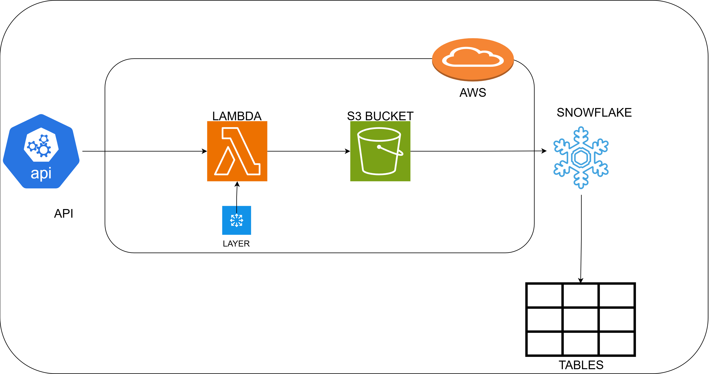

# Currency Exchange ETL with Lambda Layer

An AWS Lambda-based ETL pipeline that fetches real-time currency exchange rates from OpenExchangeRates API, stores them in S3, and loads them into Snowflake for analytics.

## Architecture



## Overview

This project implements an automated ETL pipeline that:
1. Fetches currency exchange rates from OpenExchangeRates API
2. Stores raw JSON data in S3 with partitioned structure (year/month/day/hour)
3. Loads data into Snowflake using a stored procedure
4. Uses AWS Secrets Manager for secure credential management

## Project Structure

```
currency-exchange-etl/
├── code/
│   ├── lambda_function.py      # Main Lambda handler
│   └── snowflake_provider.py   # Custom Snowflake connection provider
├── architecture/
│   └── LAYER.drawio.png        # Architecture diagram
├── environment-variables.txt    # Required environment variables
└── secret-manager.txt          # AWS Secrets Manager structure
```

## Features

- **Automated Data Collection**: Scheduled Lambda function to fetch exchange rates
- **Data Lake Storage**: Raw JSON files stored in S3 with date-based partitioning
- **Snowflake Integration**: Direct loading into Snowflake data warehouse
- **Secure Credentials**: AWS Secrets Manager integration
- **Custom Provider**: Reusable Snowflake connection provider class

## Prerequisites

- AWS Account with Lambda, S3, and Secrets Manager access
- Snowflake account
- OpenExchangeRates API key ([Get one here](https://openexchangerates.org/))
- Python 3.x
- Required Python packages:
  - boto3
  - requests
  - snowflake-connector-python

## Environment Variables

Set the following environment variables in your Lambda function:

```
environment=DEV
oer_app_id=YOUR-APP_KEY
oer_base_currency=USD
oer_base_url=https://openexchangerates.org/api/latest.json
region_name=us-east-1
s3_bucket_name=s3-currency-exchange-rate-qh
snowflake_db=CURRENCY_DB
snowflake_role=ACCOUNTADMIN
snowflake_wh=COMPUTE_WH
```

## AWS Secrets Manager Configuration

Create a secret named `db/currency-echange-rate` with the following structure:

```json
{
  "fusion_snowflake": {
    "host": "https://YOUR-ACCOUNT.snowflakecomputing.com/",
    "username": "YOUR_USERNAME",
    "password": "YOUR_PASSWORD",
    "account_name": "YOUR_ACCOUNT",
    "db": "CURRENCY_DB",
    "app_id": "YOUR_APP_ID"
  }
}
```

## Snowflake Setup

Create the following in Snowflake:

1. Database: `CURRENCY_DB`
2. Schema: `CURRENCY`
3. Table: `EXCHANGE_RATES_RAW`
4. Stored Procedure: `SP_EXCHANGE_RATE_LOADING`

## Deployment

1. Package the Lambda function with dependencies as a Lambda Layer
2. Configure environment variables
3. Set up AWS Secrets Manager with Snowflake credentials
4. Create S3 bucket for data storage
5. Set up EventBridge rule for scheduled execution
6. Deploy Lambda function

## Data Flow

1. Lambda function is triggered (scheduled or manual)
2. Fetches latest exchange rates from OpenExchangeRates API
3. Saves raw JSON to S3 with path: `exchange_rates/{year}/{month}/{day}/exchange-rates-{hour}.json`
4. Calls Snowflake stored procedure `SP_EXCHANGE_RATE_LOADING` to process and load data
5. Returns success status

## Usage

The Lambda function can be triggered:
- **Scheduled**: Using EventBridge (CloudWatch Events) for periodic execution
- **Manual**: Direct Lambda invocation for testing

## Error Handling

- API failures return appropriate error messages
- Connection errors to Snowflake are logged
- S3 upload failures are caught and reported

## License

MIT

## Author

Uzair Shah
