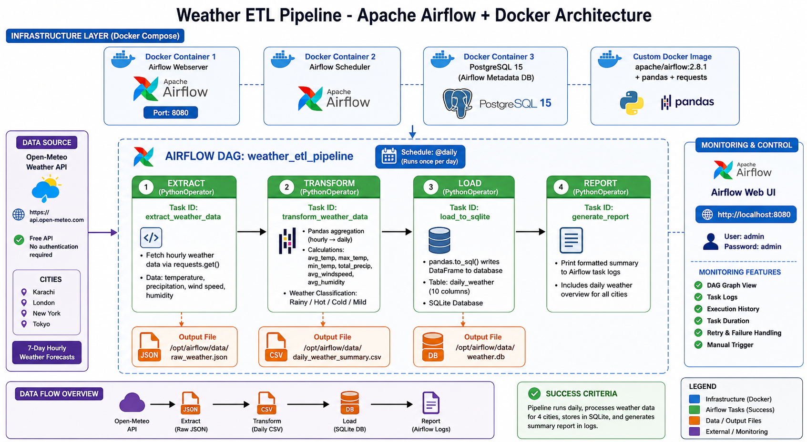

# Weather Airflow Docker ETL Pipeline

## Overview

A containerized ETL pipeline using Apache Airflow and Docker to fetch, transform, and load weather data. This project demonstrates workflow orchestration, data transformation, and database loading in a fully containerized environment.

## Project Objective

Build a production-ready ETL pipeline that:
- Extracts weather data from Open-Meteo API (no API key required)
- Transforms hourly data into daily summaries
- Loads processed data into SQLite database
- Orchestrates the entire workflow using Apache Airflow
- Runs completely in Docker containers

## Architecture



```
┌──────────────────┐
│  Open-Meteo API  │ (Free weather data)
└────────┬─────────┘
         │ Extract
         ▼
┌──────────────────┐
│  Raw JSON Data   │ (Hourly forecasts)
└────────┬─────────┘
         │ Transform
         ▼
┌──────────────────┐
│  Daily Summary   │ (Aggregated CSV)
└────────┬─────────┘
         │ Load
         ▼
┌──────────────────┐
│  SQLite Database │ (Queryable data)
└──────────────────┘

All orchestrated by Apache Airflow in Docker
```

## Technology Stack

- **Apache Airflow 2.8**: Workflow orchestration
- **Docker & Docker Compose**: Containerization
- **Python**: ETL logic
- **Pandas**: Data transformation
- **SQLite**: Data storage
- **Open-Meteo API**: Weather data source

## Quick Start

### Prerequisites
- Docker Desktop installed
- Docker Compose installed
- 4GB+ RAM available

### Run the Pipeline

```bash
cd weather-airflow-docker-etl

# Start Airflow
docker compose up -d

# Access Airflow UI
# Open browser: http://localhost:8080
# Username: airflow
# Password: airflow

# Trigger the DAG
# In Airflow UI, enable and trigger "weather_etl_dag"
```

## Features

### 1. Extract Task
- Fetches 7-day hourly weather forecast
- Covers 4 cities: Karachi, London, New York, Tokyo
- Saves raw JSON data

### 2. Transform Task
- Aggregates hourly data to daily summaries
- Calculates min/max/average temperatures
- Exports to CSV format

### 3. Load Task
- Creates SQLite database
- Loads transformed data
- Maintains data schema

### 4. Report Task
- Generates summary statistics
- Logs execution details
- Validates data quality

## Project Structure

```
WeatherAirflowDockerETL/
└── weather-airflow-docker-etl/
    ├── README.md              # Detailed documentation
    ├── docker-compose.yaml    # Airflow services
    ├── Dockerfile             # Custom Airflow image
    ├── .env                   # Environment variables
    ├── dags/
    │   └── weather_etl_dag.py # ETL pipeline DAG
    ├── data/                  # Output files
    │   ├── raw_weather.json
    │   ├── daily_weather_summary.csv
    │   └── weather.db
    ├── logs/                  # Airflow logs
    └── plugins/               # Custom plugins
```

## Output Data

### Daily Weather Summary Schema
| Column | Type | Description |
|--------|------|-------------|
| city | STRING | City name |
| date | DATE | Forecast date |
| min_temp | FLOAT | Minimum temperature (°C) |
| max_temp | FLOAT | Maximum temperature (°C) |
| avg_temp | FLOAT | Average temperature (°C) |

## Key Learnings

- Apache Airflow DAG development
- Docker containerization for data pipelines
- ETL pattern implementation
- API integration and data extraction
- Data transformation with Pandas
- Database loading and management

## Detailed Documentation

For complete setup instructions, troubleshooting, and advanced configuration, see:
**[weather-airflow-docker-etl/README.md](./weather-airflow-docker-etl/README.md)**

## Stopping the Pipeline

```bash
# Stop all containers
docker compose down

# Remove volumes (clean slate)
docker compose down -v
```

## Use Cases

- Learning Airflow fundamentals
- Understanding ETL patterns
- Docker containerization practice
- Weather data analysis
- Workflow orchestration examples

## References

- [Apache Airflow Documentation](https://airflow.apache.org/docs/)
- [Open-Meteo API](https://open-meteo.com/)
- [Docker Compose Documentation](https://docs.docker.com/compose/)
